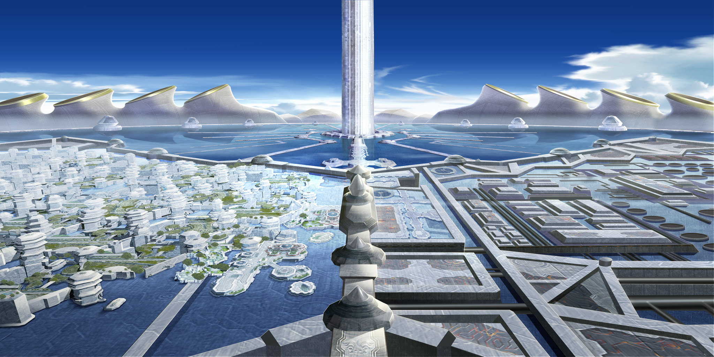

# 夢想城市

DC (Dream City，又稱夢想城市)
五年前由大企業 (DI 集團) 所打造的海上城市
位於太平洋之上的浮動城市
依照日程來往於太平洋周圍的各大國家之間
城市上面有著能夠自給自足的生活能力

擁有完全自主的自治主權
依靠強大的經濟能力與各國建立中立的友好關係

前幾年，以經濟獨立優勢吸引大量金融業進駐
近幾年，以創新開發優勢吸引大量科技業進駐
如今正以平衡都市發展為主軸，大量增加生活設施（教育、娛樂相關）

都市對於各種法律都是採取寬鬆態度
金融、科技、宗教信仰、言論自由、各種產業的規範都很自由鬆散
吸引了不少的創業家前來，但是同時也吸引了不少的犯罪者
許多國際性的犯罪組織都在這邊有據點，但是城市裡面的犯罪率卻是意外地低

- [中央區](#中央區)
- [商業區](#商業區)
- [工業區](#工業區)
- [農業區](#農業區)
- [居住區](#居住區)
- [娛樂區](#娛樂區)
- [交通區](#交通區)

# 中央區

各種官方機構都位於此處

## 中央塔

夢想城市的政府辦公處。  
所有政府管轄的事業都會在這邊設立辦公室。  

頂樓則是作為觀光用途開放著，有360度全景展望台，以及直升機可以提供繞行夢想城市一週的導覽服務。

# 商業區

辦公大樓林立，許多國際性的公司都在這邊設立分公司。

# 工業區

工廠區域

# 農業區

農業地區，蓋有各式各樣農地、溫室，出產各種農作物供給城市使用。

## 研究所

農業區的各種農作物種植、以及動物的養殖都由農業研究所進行管理。

## 溫室

由農業研究所管理著的溫室，裡面種植了許多供應夢想城市食用的農作物。

# 居住區

大部分的城市居民都會住在這個區域，各種生活必須物資都可以在這邊找到。

## 酒吧

隱藏在居住區各地的眾多酒吧。  
其中一個就是當時鼎鼎大名的愛麗絲的發跡地點。  
但是在愛麗絲已經消失的現在，生意也回到了普普通通不大有人氣的狀態。

## Live House

免費提供場地給各樂團表演的 Live House。  
許多的有名藝人都曾經在這邊表演過。

# 娛樂區

以觀光客為主的區域，包含遊樂園、賭場、酒店、夜店、海灘、高級飯店。

## 夢想劇場

前一陣子剛開幕的大型劇場，表演項目以歌劇為主，偶爾也會有一些演唱會或是馬戲團的表演在此進行。  
開幕公演當天遭受了[恐怖攻擊](../episode_1/夢想劇院開幕公演.md)。

# 交通區

機場跟港口、所有的跨國移動都必須經由這邊
